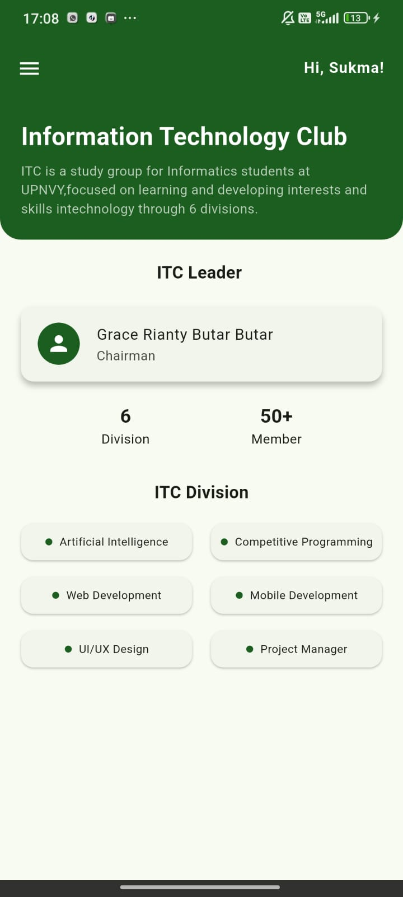
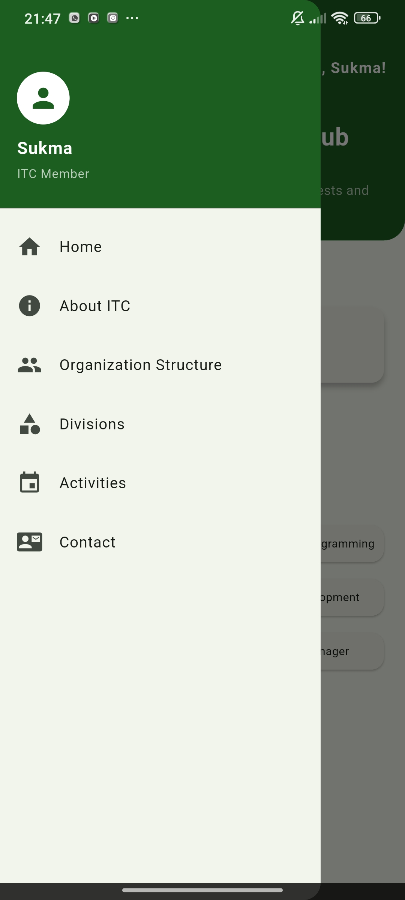
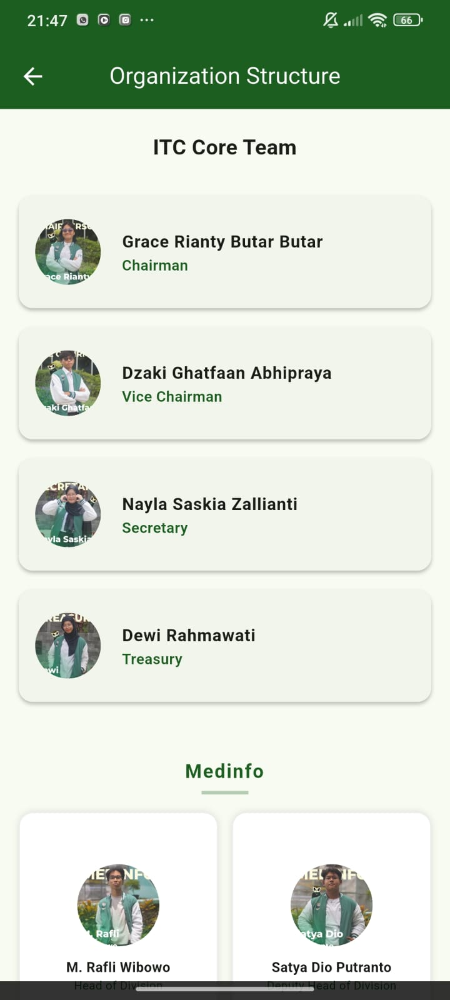
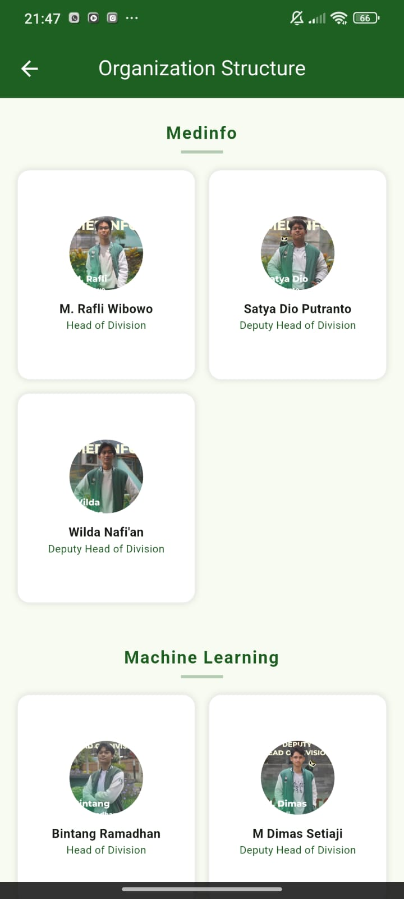
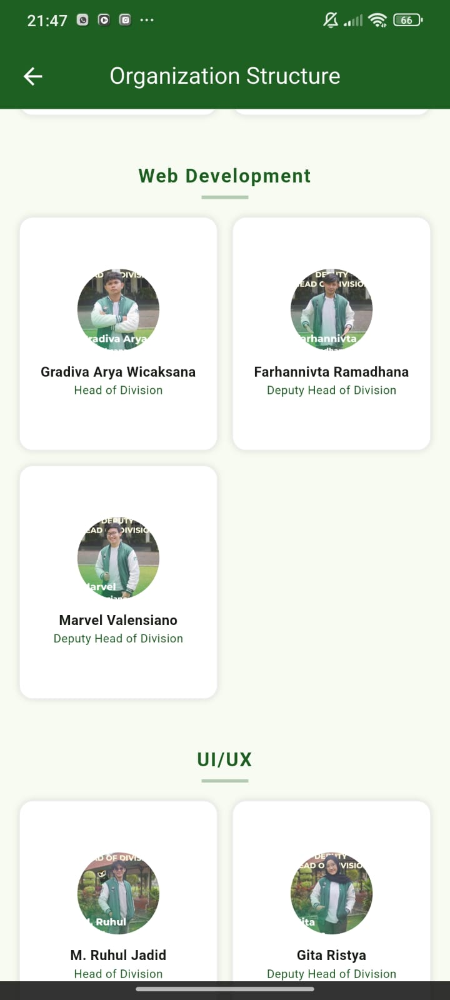
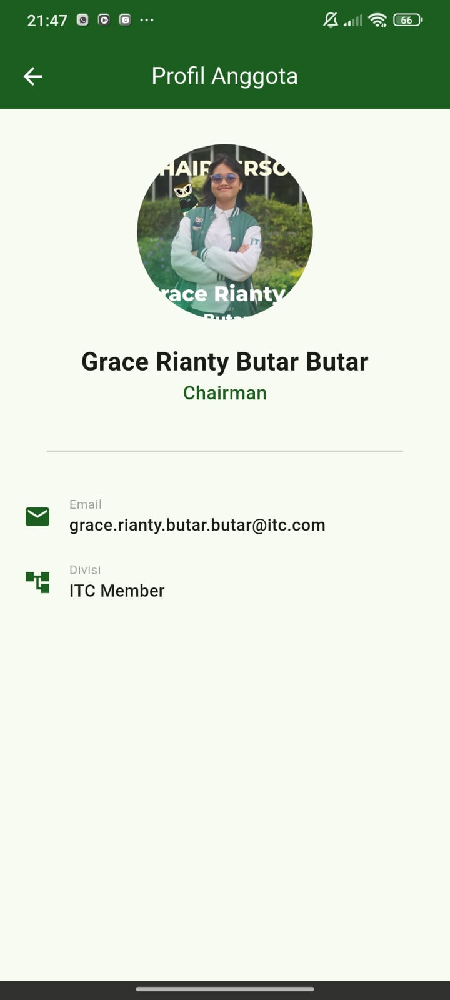

<<<<<<< HEAD
# itc-the-seeker-2026-Sukmawati-Kharisma-Gati
## Preview Aplikasi

Cara Menjalankan Aplikasi
### Menggunakan Terminal (Flutter CLI)
1. Clone repository:
git clone https://github.com/Sukma216/itc-the-seeker-2026-Sukmawati-Kharisma-Gati
2. Masuk ke folder project:
3. Install dependencies:
flutter pub get
4. Jalankan aplikasi:
flutter run
### Menggunakan Android Studio
1. Buka Android Studio
2. Klik **Open** → pilih folder project kamu
3. Tunggu proses indexing selesai
4. Jalankan emulator
   atau hubungkan HP (USB Debugging aktif)
5. Klik tombol  **Run**

=======
# flutter_application_1

A new Flutter project.

## Getting Started

This project is a starting point for a Flutter application.

A few resources to get you started if this is your first Flutter project:

- [Learn Flutter](https://docs.flutter.dev/get-started/learn-flutter)
- [Write your first Flutter app](https://docs.flutter.dev/get-started/codelab)
- [Flutter learning resources](https://docs.flutter.dev/reference/learning-resources)

For help getting started with Flutter development, view the
[online documentation](https://docs.flutter.dev/), which offers tutorials,
samples, guidance on mobile development, and a full API reference.
>>>>>>> b5989f0 (upload projeck mobile itc)
